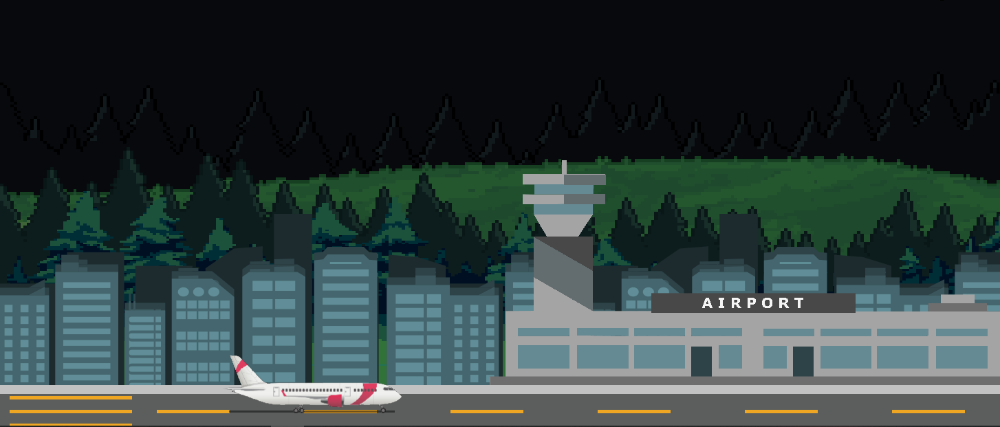

# Python 2D-Flight Simulator Game

A simple 2D-flight simulator built using PyGame and using a realistic aerodynamics engine. 

This is a practice project of mine to learn more about PyGame and aerodynamics, to develop a flight 
simulator that can serve as an environment for reinforced learning projects later on. 

## Requirements
- Python 3.x
- PyGame

## How to Run
1. Clone or download the repository
2. Install the required packages by running `pip install -r requirements.txt`
3. Run the simulator by executing `python flight_simulator.py`

# Instructions 

The current workflow of the game is very simple. The aircraft starts on an airport's runway. It has to take off, reach a certain altitude and land at one of the airports without crashing. The horizontal and vertical speeds of the aircraft are updated each frame based on (approximately) real physics: 
- The lift and drag (coefficients) of the airplane depend on both the angle-of-attack, flap deflection angles, and match speed of the aircraft. 
- The thrust is set manually by the player but decreases with the air density as the altitude increases.  
- While the gear is down it will increase the drag on the airplane. 
- By default, all technical specifications of the aircraft are taken from the technical sheet of the Airbus A320-232. These can be changed by editing the script.
- The aircraft can be decelerated in the air by means of pitching, thrust and flaps, or on the ground by means of friction or thrust reversal. 
- The aircraft's thrust will consume fuel. If it runs out of fuel the aircraft will still fly but will not generate any thrust.  

The thrust and pitch of the aircraft are controlled by the directional keys: 
- `UP` - Increase thrust power (0-100%). 
- `DOWN` - Decrease thrust power (1-100%). On the ground, thrust can be set to negative values indicating the activation of thrust reversers.  
- `LEFT` - Pitch the nose of the aircraft up.
- `RIGHT` - Pitch the nose of the aircraft down.

Other controls:
- `Q` Increase flap deflection angle. 
- `A` Decrease flap deflection angle. 
- `W` Gear up/down. 
- `D` Brakes 
- `S` Spoilers (air brakes)

The game is over:
- if the aircraft reaches the ground with a kinetic energy exceeding a critical threshold
- if the aircraft touches the ground without a runway
- if the aircraft exceeds the manufacturer's critical speed.  

## Features
- Approximate realistic and responsive flight physics
- Simple keyboard controls
- Instrument panel displaying important flight information

Future updates might include:
- Stall alerts
- Emergencies (engine failures, flap blockages, etc) 
- Autopilot trained by reinforced learning 

## Credits

- Pixel art backgrounds by [Vicente Nitti](https://vnitti.itch.io/) (@vnitti), [Admurin](https://admurin.itch.io/) (@admurin), and [byKGF](https://bykgf.itch.io/).

## Licence
This project is licensed under the MIT License.